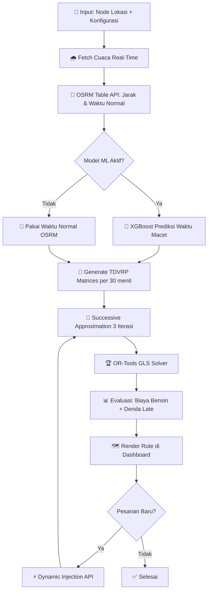

# 🚛 Dynamic Vehicle Routing Problem (DVRP) for Time-Dependent Pickup & Delivery with Machine Learning–Based Travel Time Prediction

> **Tugas Akhir (Skripsi)** — Dicky Eka Putra  
> Institut Teknologi Sepuluh Nopember (ITS) Surabaya, 2026

---

## 📌 Ringkasan Proyek

Sistem optimasi rute logistik last-mile di wilayah **Kecamatan Tegalsari, Surabaya** yang menggabungkan **Machine Learning** dengan **Operations Research** untuk menentukan rute kurir paling efisien secara waktu, bukan hanya jarak.

### Mengapa Proyek Ini Penting?
Pendekatan VRP tradisional menentukan rute berdasarkan **jarak terpendek** (distance-based), namun mengabaikan fakta bahwa ruas jalan terdekat bisa saja **sedang macet parah**. Sistem ini menggunakan model **XGBoost** yang dilatih dari data Google Maps Traffic historis untuk **memprediksi waktu tempuh aktual** berdasarkan:

| Fitur Prediksi | Deskripsi |
|---|---|
| `distance_meters` | Jarak OSRM antar titik (meter) |
| `duration_normal_sec` | Waktu tempuh normal tanpa lalu lintas |
| `hour_of_day` | Jam keberangkatan (0–23) |
| `day_code` | Hari dalam seminggu (0=Senin, 6=Minggu) |
| `is_rain` | Status hujan (0/1) dari OpenWeatherMap API |
| `origin_lat`, `origin_lng` | Koordinat asal |
| `dest_lat`, `dest_lng` | Koordinat tujuan |

---

## 🏗️ Arsitektur Sistem

```
┌─────────────────────────────────────────────────────────────────────┐
│                          FRONTEND (React.js + Vite)                 │
│  ┌───────────┐ ┌──────────┐ ┌──────────────┐ ┌──────────────────┐  │
│  │ Dashboard │ │ Map View │ │  Analytics   │ │ Courier Sim View │  │
│  │   (KPI)   │ │ (Leaflet)│ │ (AI vs Bench)│ │ (DVRP + DOD)     │  │
│  └───────────┘ └────┬─────┘ └──────────────┘ └────────┬─────────┘  │
│                     │                                  │            │
│               OSRM Road-Snap                  Turf.js Interpolation │
│                     │                                  │            │
│              ┌──────┴──────┐                    ┌──────┴──────┐     │
│              │ OSRM Server │                    │ OSRM /trip  │     │
│              │ (Docker)    │                    │ (Rerouting) │     │
│              └──────┬──────┘                    └──────┬──────┘     │
│                     │                                  │            │
└─────────────────────┼──────────────────────────────────┼────────────┘
                      │            REST API               │
               ┌──────┴──────────────────────────────────┴──────┐
               │              BACKEND (FastAPI + OR-Tools)       │
               │  ┌──────────────────────────────────────────┐   │
               │  │  /optimize — Static VRP Optimization     │   │
               │  │  /dynamic_injection — Mid-Route DVRP     │   │
               │  │  /search_location — Geocoding Cache      │   │
               │  └──────────────────────────────────────────┘   │
               │                       │                         │
               │    ┌──────────────────┴──────────────────┐      │
               │    │   XGBoost ML Model (via MLflow)     │      │
               │    │   Travel Time Prediction Engine     │      │
               │    └──────────────────┬──────────────────┘      │
               │                       │                         │
               │    ┌──────────────────┴──────────────────┐      │
               │    │   OR-Tools Solver (GLS Metaheuristic)│     │
               │    │   + Successive Approximation (SA)    │     │
               │    └─────────────────────────────────────┘      │
               └─────────────────────────────────────────────────┘
```

---

## 🔬 Fitur Utama

### 1. **Time-Dependent VRP (TDVRP) dengan Successive Approximation**
- Matriks waktu tempuh berubah setiap **30 menit** (jam 07:00–19:00)
- Successive Approximation (SA) **3 iterasi** memperbarui matriks berdasarkan ETA aktual rute sebelumnya
- Memperhitungkan **Time Windows**, **Vehicle Capacity**, dan **Service Time**

### 2. **Dynamic VRP (DVRP) — Mid-Route Order Injection**
- Pesanan baru dapat diinjeksi saat kurir **sedang dalam perjalanan**
- Sistem membangun "2 Parallel Universe": AI vs Benchmark, lalu menjahit (_stitch_) rute lama dengan rute baru
- Evaluasi ulang **biaya bensin + denda keterlambatan** secara adil

### 3. **AI vs Benchmark Comparison**
- Setiap optimasi menjalankan **2 solver secara paralel**:
  - 🤖 **AI Solver** — Cost = waktu tempuh prediksi XGBoost (sadar kemacetan)
  - 📏 **Benchmark Solver** — Cost = jarak OSRM (buta kemacetan)
- Simulasi "wasit" mengukur performa keduanya di bawah **kondisi lalu lintas yang sama**

### 4. **Real-Time Courier Simulation**
- Animasi kurir bergerak di peta menggunakan **Turf.js arc-length interpolation**
- Scrubber timeline untuk **rewind/fast-forward** tanpa state desync
- **Degree of Dynamism (DOD)** slider untuk menginjeksi pesanan dinamis secara otomatis
- OSRM `/trip` rerouting secara real-time saat pesanan baru muncul

### 5. **Traffic-Aware Map Visualization**
- Polyline berwarna berdasarkan **rasio kemacetan** (biru/kuning/merah)
- Road-snapped geometry dari OSRM (bukan garis lurus)
- Side-by-side AI Map vs Benchmark Map

---

## 🛠️ Tech Stack

| Layer | Teknologi |
|---|---|
| **Machine Learning** | XGBoost, Scikit-Learn, Pandas, NumPy |
| **Experiment Tracking** | MLflow (SQLite backend) |
| **Routing Solver** | Google OR-Tools (GLS Metaheuristic) |
| **Routing Engine** | OSRM — Dockerized (Contraction Hierarchies, Peta Jawa) |
| **Backend API** | Python FastAPI, Uvicorn, Pydantic, SQLite |
| **Frontend** | React.js 18, Vite, Leaflet, Turf.js, Lucide Icons |
| **Weather API** | OpenWeatherMap (current + forecast) |
| **Geocoding** | OpenStreetMap Nominatim (with local SQLite cache) |
| **Infrastructure** | Docker Compose, Conda |

---

## 📂 Struktur Repositori

```text
/Bachelor-Thesis
│
├── 📁 infrastructure/                 ← OSRM MAP SERVER
│   └── 📁 osrm/
│       ├── docker-compose.yml         ← Docker Runner (CH algorithm, port 5001)
│       └── java-latest.osrm.*        ← Pre-processed routing index (~4.5GB)
│
├── 📁 ml_pipeline/                    ← ML EXPERIMENTATION ZONE
│   ├── harvest_traffic.py             ← Google Maps Traffic data scraper (scheduled)
│   ├── perbaiki_dataset.py            ← Data cleaning & augmentation
│   ├── train_thesis_final.py          ← Final XGBoost training script (GPU-accelerated)
│   ├── parameter_tuning.py            ← Optuna hyperparameter tuning
│   ├── vrp_compare.py                 ← AI vs Traditional VRP benchmarking CLI
│   ├── test_dynamic_dod.py            ← Dynamic DOD test scenarios
│   ├── dataset_*.csv                  ← Historical traffic datasets
│   └── 📁 models/                     ← Saved XGBoost model artifacts
│
├── 📁 vrp-project/                    ← FULLSTACK WEB APPLICATION
│   │
│   ├── 📁 backend/                    ← BRAIN (Python FastAPI)
│   │   ├── main.py                    ← API endpoints: /optimize, /dynamic_injection
│   │   ├── geocode.py                 ← Nominatim geocoding helper
│   │   ├── test_eval.py               ← Backend evaluation tests
│   │   ├── locations.db               ← Geocoding cache (SQLite)
│   │   ├── .env                       ← API keys & MLflow Run ID
│   │   └── requirements.txt           ← Python dependencies
│   │
│   └── 📁 frontend/                   ← FACE (React.js + Vite)
│       ├── package.json               ← NPM dependencies
│       └── 📁 src/
│           ├── App.jsx                ← Main dashboard: maps, KPIs, route panels
│           ├── CourierMobileView.jsx   ← Mobile-first courier simulation view
│           ├── useDvrpSimulation.js    ← Pure derived-state DVRP simulation hook
│           ├── index.css              ← Global styles (glassmorphism, animations)
│           └── main.jsx               ← Vite entry point
│
├── requirements.txt                   ← Top-level Python dependencies
├── .gitignore                         ← Git exclusions (node_modules, .osrm, mlruns)
└── LICENSE                            ← GNU AGPL v3
```

---

## 🚀 Panduan Menjalankan

### Prasyarat

- **Python 3.10+** (via Conda direkomendasikan)
- **Node.js 18+** dan npm
- **Docker** dan Docker Compose
- **NVIDIA GPU** (opsional, untuk training XGBoost dengan CUDA)

### 1. OSRM Map Server

```bash
cd infrastructure/osrm
docker-compose up -d
```

> Server OSRM berjalan di `http://localhost:5001` (port 5000 dipakai MLflow).  
> Data peta pre-processed (~4.5GB) harus sudah ada di folder `infrastructure/osrm/`.

### 2. Backend API (FastAPI)

```bash
# Aktifkan environment Conda
conda activate <nama-environment>

# Install dependencies
pip install -r requirements.txt

# Setup .env
cd vrp-project/backend
# Isi file .env dengan:
#   OPENWEATHER_API_KEY=<your-key>
#   MLFLOW_RUN_ID=<run-id-dari-mlflow>
#   MLFLOW_TRACKING_URI=sqlite:///<path>/mlflow_skripsi.db

# Jalankan server
uvicorn main:app --reload --port 8000
```

### 3. Frontend Dashboard (React + Vite)

```bash
cd vrp-project/frontend
npm install
npm run dev
```

> Frontend berjalan di `http://localhost:5173` dan mem-proxy API ke backend.

### 4. (Opsional) Training Model ML

```bash
cd ml_pipeline

# Jalankan MLflow UI untuk tracking
mlflow ui --backend-store-uri sqlite:///mlflow_skripsi.db --port 5000

# Training model XGBoost
python train_thesis_final.py
```

---

## 📊 Alur Kerja Sistem



---

## 📈 Metrik Evaluasi

| Metrik | Deskripsi |
|---|---|
| **RMSE** | Root Mean Square Error prediksi waktu tempuh |
| **MAE** | Mean Absolute Error prediksi waktu tempuh |
| **R²** | Koefisien determinasi model ML |
| **Total Cost (Rp)** | Biaya bensin + denda keterlambatan Time Window |
| **Late Count** | Jumlah pelanggaran Time Window |
| **Savings (Rp)** | Selisih biaya Benchmark − AI |

---

## 🔑 Environment Variables

File `.env` di `vrp-project/backend/`:

```env
OPENWEATHER_API_KEY=<your-openweathermap-api-key>
MLFLOW_RUN_ID=<mlflow-run-id-model-terbaik>
MLFLOW_TRACKING_URI=sqlite:///<absolute-path>/mlflow_skripsi.db
```

---

## 📜 Lisensi

Proyek ini dilisensikan di bawah **GNU Affero General Public License v3.0** — lihat file [LICENSE](LICENSE) untuk detail.

---

**Dicky Eka Putra** — Mahasiswa Tingkat Akhir, Institut Teknologi Sepuluh Nopember (ITS)  
Tugas Akhir 2026 • Departemen Matematika
